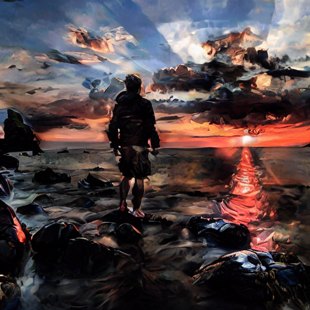

# Raphael Sanzio Style Transfer with StyleID and LoRA

 

# Reference

[1] J. Chung, S. Hyun, and J. Heo, "Style Injection in Diffusion: A Training-free Approach for Adapting Large-scale Diffusion Models for Style Transfer," in Proceedings of the IEEE/CVF Conference on Computer Vision and Pattern Recognition (CVPR), June 2024, pp. 8795-8805.

[1] E. J. Hu, Y. Shen, P. Wallis, Z. Allen-Zhu, Y. Li, S. Wang, L. Wang, and W. Chen, "LoRA: Low-Rank Adaptation of Large Language Models," arXiv:2106.09685v2 [cs.CL], Oct. 2021. https://doi.org/10.48550/arXiv.2106.09685

